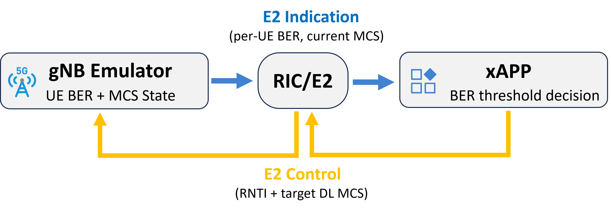

# MRN O-RAN Project - Milestone 2

**Project 2: BER-based Downlink MCS Control xApp**  


## Overview

This repository contains my Milestone 2 implementation for Project 2 of the MRN O-RAN course project.

The implemented closed loop is:

```text
gNB emulator -> E2 Indication -> xApp BER decision -> E2 Control -> gNB MCS update
```

The gNB emulator reports per-UE downlink BER and MCS state. The xApp checks the BER against a configurable threshold and sends an E2 control request with the target downlink MCS. The gNB emulator then stores the requested MCS state in memory.

<p align="center">
  
</p>

## Deliverables

- Demo video: `M2_Project2.mp4`
- Source code: `ric-composer/`

## Main Code Structure

```text
project_ORAN/
├── README.md
├── figures/
├── M2_Project2.mp4
└── ric-composer/
    ├── dev-compose.yaml
    ├── oai-oran-protolib/
    │   ├── ran_messages.proto
    │   └── builds/
    ├── gNB-e2sm-emu/
    │   ├── gnb_message_handlers.c
    │   └── gnb_message_handlers.h
    └── xapp-e2ap-py/
        ├── myxapp.py
        └── src/e2ap_xapp.py
```

## Important Files

### Protobuf / E2SM

`ric-composer/oai-oran-protolib/ran_messages.proto`

The UE message was extended with Project 2 fields:

```proto
optional float dl_ber = 7;
optional int32 dl_mcs = 8;
optional int32 target_dl_mcs = 9;
```

These fields carry the monitored downlink BER, the current downlink MCS, and the target downlink MCS controlled by the xApp.

### gNB Emulator

`ric-composer/gNB-e2sm-emu/gnb_message_handlers.c`  
`ric-composer/gNB-e2sm-emu/gnb_message_handlers.h`

The gNB emulator was extended to report multiple UEs, generate BER values above and below the threshold, include the new UE fields in indication responses, and apply the received target downlink MCS values.

### xApp

`ric-composer/xapp-e2ap-py/myxapp.py`  
`ric-composer/xapp-e2ap-py/src/e2ap_xapp.py`

The xApp monitors each UE's BER, decides whether to force a low MCS or keep normal operation, and sends a control request when an update is needed.

## Demo Command

Run the monitoring/control xApp inside the xApp container:

```bash
cd /python_xapp
python3 myxapp.py --ber-threshold 0.10 --target-low-mcs 4 --normal-mcs 20 --interval 0.5
```

In this demo:

- BER threshold: `0.10`
- Low MCS: `4`
- Normal MCS: `20`
- Monitoring interval: `0.5 s`

The threshold and MCS values are xApp parameters. The project only fixes the monitoring interval requirement to 500 ms.

## Validation Evidence

The xApp terminal shows BER monitoring, per-UE decisions, and control request transmission:

```text
RIC Indication received from gNB ...
UE 17921: dl_ber=0.0500 ... decision=FORCE_LOW_MCS
UE 17922: dl_ber=0.2000 ... decision=NORMAL_OPERATION
Sent control request with 4 UE MCS update(s)
```

The gNB terminal confirms that the control request was received and applied:

```text
Control message received
Applying target parameter ue_list
Applied DL MCS target 4 to RNTI 17921
Applied DL MCS target 20 to RNTI 17922
```

This verifies the required closed loop: BER monitoring, xApp decision, E2 control request, and gNB-side MCS update for multiple UEs.
